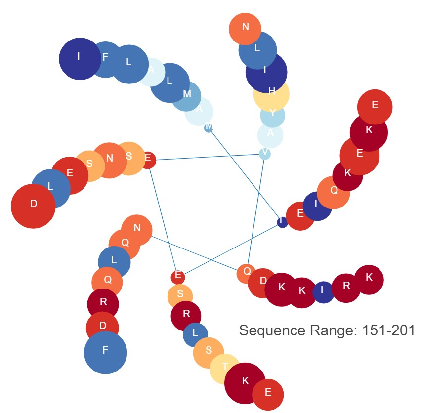

# HWP.py

HWP.py is a script for generating helical wheel projections (HWPs) from linear amino acid sequences. HWPs display amino acids of a protein region as they would appear if they were to adopt a helical secondary structure. Among other things, this allows for the identification of amphipathic regions -- regions where one side of the helix is enriched with hydrophobic amino acids while the other side is enriched for hydrophilic amino acids. HWP.py can plot traditional alpha helices (18-member rings) or coiled-coil domains (7-member rings). Optionally, you can also provide a sequence alignment in which case the size of each circle will represent the degree of conservation.

